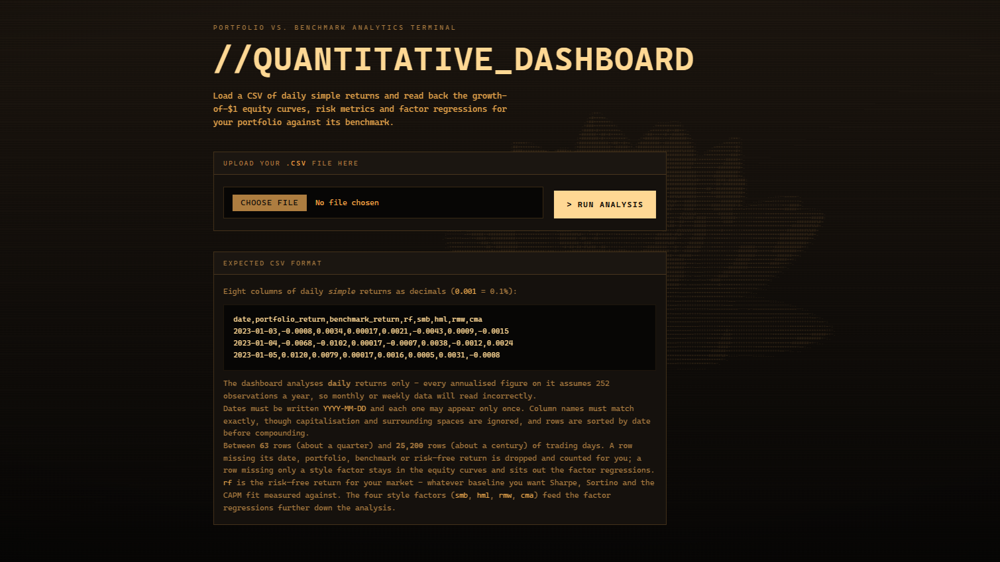
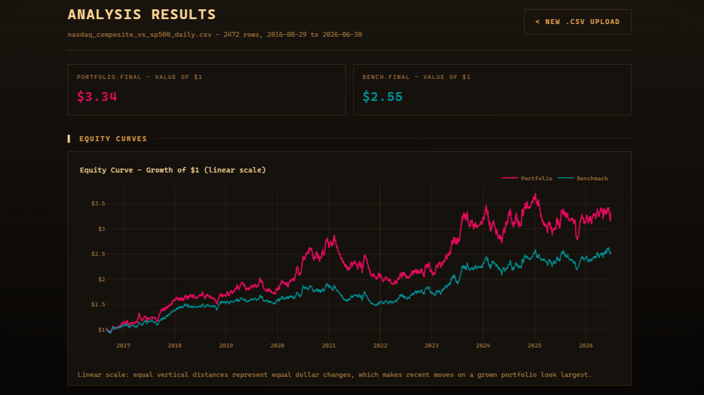
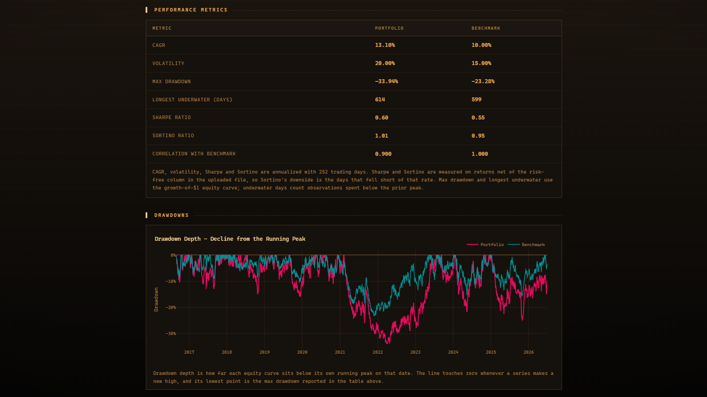
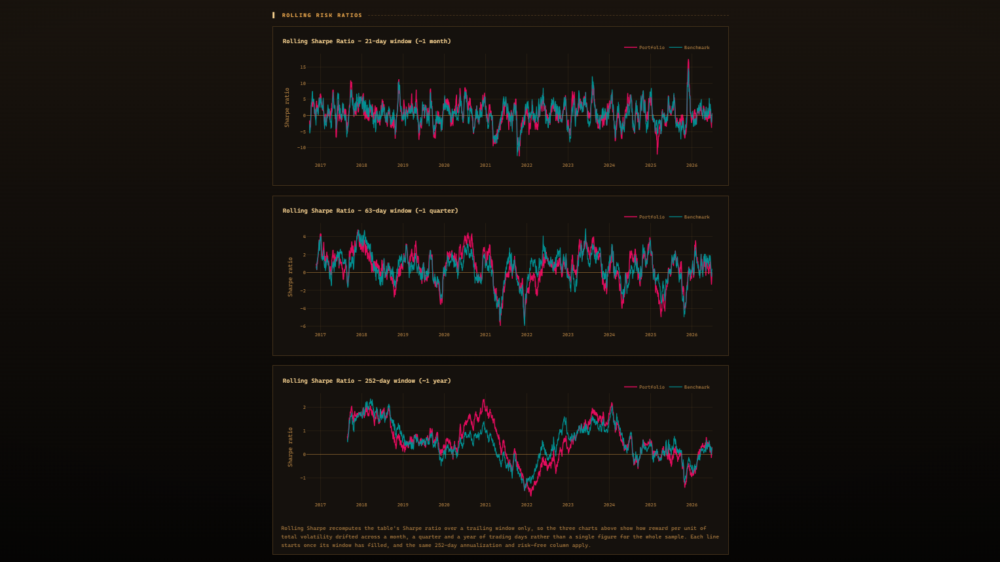
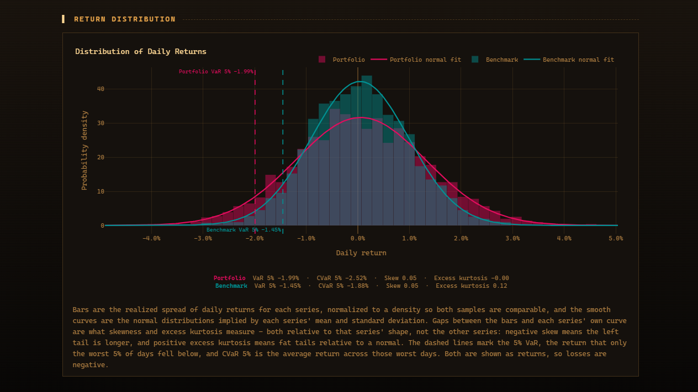
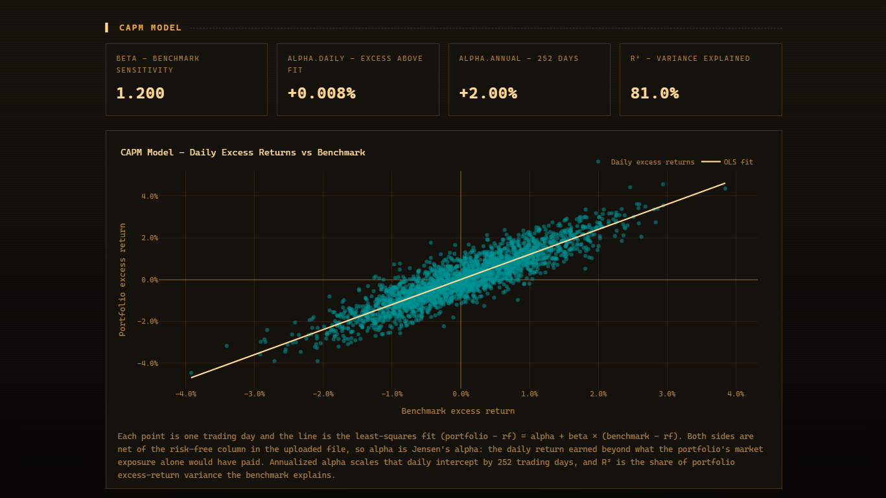
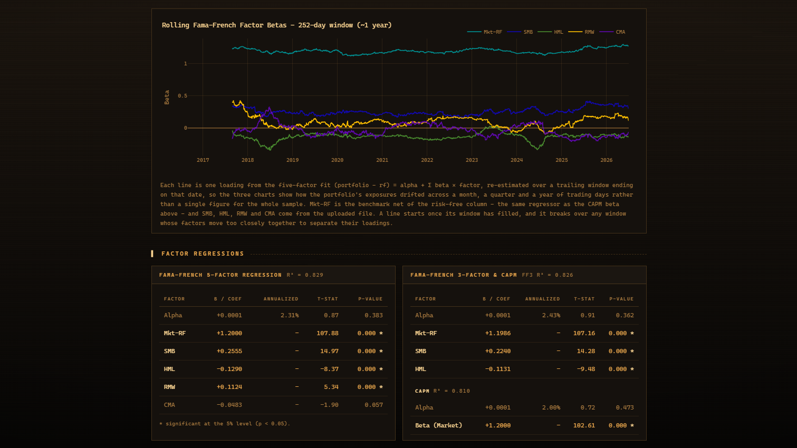

# Quant Dashboard

Quant Dashboard is a local Flask app for **portfolio-versus-benchmark analytics**. You upload a CSV of daily simple returns. The server compounds those returns, measures risk, and fits CAPM and Fama–French regressions. Nothing is fetched at runtime: there is no live market feed, no database, and no API key.

The two sections below are the whole product. The first explains every quantity the page reports, with the formulas the code actually uses. The second is how to run it.

---

## Highlights



*Landing page. Pick a `.csv` and press **Run Analysis**. The panel below shows a sample header row and spells out the upload rules: decimals rather than percents, `YYYY-MM-DD` dates, and 63–25,200 rows.*



*Top of the results page. The header repeats the source filename, row count, and date range; the two cards give the final value of $1 for each series. Below them is the growth-of-$1 curve on a linear scale — pink is the portfolio, teal the benchmark.*



*Full-sample performance metrics — CAGR, volatility, max drawdown, longest underwater, Sharpe, Sortino, and correlation — followed by the drawdown-depth chart, which plots each curve's decline from its own running peak.*



*Rolling risk ratios. The same Sharpe formula recomputed on trailing windows of 21, 63, and 252 trading days, so the reward-per-unit-of-volatility over a month, a quarter, and a year can be compared.*



*Return distribution. Density histograms of daily returns with each series' implied normal curve, dashed 5% VaR markers, and a readout of VaR, CVaR, skew, and excess kurtosis for both series.*



*CAPM section. Cards report beta, daily and annualized alpha, and R²; the scatter plots one trading day per point — portfolio excess return against benchmark excess return — with the least-squares line through them.*



*Rolling 252-day Fama–French five-factor loadings (Mkt-RF, SMB, HML, RMW, CMA), and beneath them the full-sample regression tables: FF5 on the left, FF3 and CAPM on the right, each coefficient with its t-statistic and p-value.*

---

## 1. Concepts and math

Every series in the upload should be a **simple daily return** written as a decimal: `0.01` meaning +1%. The app uses simple daily returns and annualizes on 252 trading days. Upload one row per trading day only - other frequencies will misstate annualized metrics.

### 1.1 What you upload

Eight columns, in any order, with these names:

| Column | Role |
|---|---|
| `date` | Observation date, `YYYY-MM-DD`, unique |
| `portfolio_return` | Daily simple return of the strategy or asset you want measured |
| `benchmark_return` | Daily simple return of the comparison series |
| `rf` | Daily risk-free return (T-bills, cash, or any baseline you choose) |
| `smb` | Small Minus Big — size |
| `hml` | High Minus Low — value |
| `rmw` | Robust Minus Weak — profitability |
| `cma` | Conservative Minus Aggressive — investment |

The four style columns are Fama–French **style premia**. The fifth regressor of the five-factor model, the market factor, is **not** a column. It is derived from the benchmark:

$$\text{Mkt-RF}_t = r_{\text{benchmark},t} - r_{f,t}$$

That is the uploaded benchmark net of the uploaded `rf`, not Ken French’s CRSP market series unless you put that series in `benchmark_return`.

**Sample rules.** Dates must fall on or after 1900-01-01. A file needs between 63 and 25,200 rows after cleaning (about a quarter of a year through about a century of trading days). The upload cap is 10 MB. Returns of −1 or lower are rejected because they would wipe the wealth index. Rows missing `date`, `portfolio_return`, `benchmark_return`, or `rf` are dropped. Rows that only miss style factors still enter equity curves, performance stats, and CAPM; they are excluded from Fama–French fits.

### 1.2 Excess returns

**Excess return** is the series return minus the uploaded risk-free column, computed every day:

$$r^{\text{excess}}_t = r_t - r_{f,t}$$

Sharpe, Sortino, CAPM, and the factor models all use excess returns. Growth, volatility, drawdowns, VaR, and CVaR use **total** returns — the dollars an investor actually earned.

### 1.3 Growth of $1 and CAGR

A dollar invested at the start and left to compound is the equity curve:

$$W_0 = 1, \qquad W_t = \prod_{i=1}^{t} (1 + r_i)$$

The page charts this twice: a **linear** scale (equal vertical gaps are equal dollars, so late moves on a grown portfolio look largest) and a **log** scale (equal vertical gaps are equal percentages).

**CAGR** is the constant annual rate that would have produced the same terminal wealth:

$$
\text{CAGR} =
\begin{cases}
W_n^{252/n} - 1 & \text{if } W_n > 0 \\
-1 & \text{if } W_n \le 0
\end{cases}
$$

where \(n\) is the number of daily observations. It is computed from total returns, not excess returns.

### 1.4 Volatility, Sharpe, Sortino, correlation

**Annualized volatility** is the sample standard deviation of daily total returns, scaled to a year:

$$\sigma = \mathrm{std}(r, \mathrm{ddof}=1) \times \sqrt{252}$$

**Sharpe** is mean excess return per unit of excess-return volatility, then annualized:

$$\text{Sharpe} = \frac{\overline{r - r_f}}{\mathrm{std}(r - r_f, \mathrm{ddof}=1)} \times \sqrt{252}$$

If excess-return volatility is zero, Sharpe is left blank.

**Sortino** uses the same numerator. The denominator is the sample standard deviation of **only the days whose excess return is negative** (days that fell short of `rf`). It is undefined if there are no such days, or if those days have no spread. Then it is annualized the same way:

$$\text{Sortino} = \frac{\overline{r - r_f}}{\mathrm{std}(\{r_t - r_{f,t} : r_t - r_{f,t} < 0\})} \times \sqrt{252}$$

**Correlation** is the Pearson correlation of the two **total** daily return series. The benchmark’s own row is 1 by construction.

### 1.5 Drawdowns

Drawdown on date \(t\) is how far wealth sits below its running peak:

$$DD_t = \frac{W_t}{\max_{s \le t} W_s} - 1$$

The line touches zero on a new high. **Maximum drawdown** is the most negative value of that series.

**Longest underwater** is the longest run of observations with \(DD_t < 0\). An open drawdown at the end of the file counts through the last date. The count is in **trading days**, not calendar days.

The **time-underwater** chart is a running counter: it increments while the series is below its peak and resets to zero on a new high.

### 1.6 Return distribution, VaR, CVaR

The histogram is the realized spread of daily total returns, drawn as a probability density so the two series are comparable. The smooth curves are normal densities with each series’ own mean and standard deviation:

$$f(x) = \frac{1}{\sigma\sqrt{2\pi}} \exp\left(-\frac{1}{2}\left(\frac{x-\mu}{\sigma}\right)^2\right)$$

**Skewness** measures whether large moves are more often to the downside or the upside. Negative skew means a longer left tail than the normal overlay — crash days pull harder than equally large gains. **Excess kurtosis** measures how heavy the tails are relative to a normal distribution with the same mean and volatility: zero matches that normal sample; positive means extreme days are more common than the overlay suggests.

**VaR 5%** is the empirical 5th percentile of daily total returns — the level that only the worst 5% of days fell at or below. **CVaR 5%** (expected shortfall) is the mean of those days:

$$\text{VaR}_{0.05} = Q_{0.05}(r), \qquad \text{CVaR}_{0.05} = \mathrm{mean}\{r_t : r_t \le \text{VaR}_{0.05}\}$$

Both are returns, not positive loss amounts: a bad day is a negative number.

### 1.7 Rolling Sharpe and Sortino

The table Sharpe and Sortino are one number for the whole sample. The rolling charts recompute the same formulas on a trailing window of 21, 63, or 252 trading days (about a month, a quarter, and a year). Each line starts once its window has filled. Rolling Sortino also needs at least two losing days inside the window; otherwise that date is a gap. The same 252-day annualization and the same `rf` column apply.

### 1.8 CAPM

The Capital Asset Pricing Model here is a regression of portfolio excess returns on benchmark excess returns:

$$(r_{p,t} - r_{f,t}) = \alpha + \beta\,(r_{b,t} - r_{f,t}) + \varepsilon_t$$

| Quantity | Meaning |
|---|---|
| **Beta** | Slope. How far the portfolio moved with the benchmark, net of `rf`. |
| **Alpha (daily)** | Intercept. Jensen’s alpha: the daily excess return left after that market exposure. |
| **Alpha (annual)** | Daily alpha × 252. |
| **R²** | Square of the correlation of the two excess-return series: the share of portfolio excess-return variance the benchmark explains. |

The scatter is this univariate OLS fit. The factor-table CAPM is the same model run through statsmodels so each coefficient also has a t-statistic and a p-value. A p-value below 0.05 is marked `*`. A constant benchmark excess return is rejected: there is then no market move to regress against.

### 1.9 Fama–French factor models

The five-factor model is the CAPM with the four uploaded style premia added:

$$
(r_{p,t} - r_{f,t})
= \alpha
+ \beta_{\text{Mkt}}\,\text{Mkt-RF}_t
+ \beta_{\text{SMB}}\,\text{SMB}_t
+ \beta_{\text{HML}}\,\text{HML}_t
+ \beta_{\text{RMW}}\,\text{RMW}_t
+ \beta_{\text{CMA}}\,\text{CMA}_t
+ \varepsilon_t
$$

The **three-factor** model drops RMW and CMA. Both are fitted only on rows that have all four style factors.

Two kinds of beta appear on the page, and they are not interchangeable:

- **Partial beta** (tables and rolling charts): the coefficient from the multivariate OLS, with the other factors held fixed.
- **Simple beta** (style-factor scatter charts): univariate OLS of portfolio excess returns on that one factor alone.

Only **alpha** is annualized (× 252). A loading is a ratio and is left unscaled. R² is the share of portfolio **excess-return** variance the named factors explain.

**Rolling five-factor betas** re-estimate the same FF5 equation on each trailing 21-, 63-, or 252-day window and plot the five loadings (not the window’s alpha). Dates before the window fills stay blank, as do windows whose design matrix is rank-deficient (constant or collinear regressors).

Full-sample tables that cannot pin down a unique solution are omitted rather than filled with a pseudo-inverse.

### 1.10 Sample dataset

[`ExampleCSV/nasdaq_composite_vs_sp500_daily.csv`](ExampleCSV/nasdaq_composite_vs_sp500_daily.csv) is a hybrid file. Dates, `rf`, and the four style factors come from Kenneth French’s daily five-factor library (percent figures converted to decimals). `portfolio_return` and `benchmark_return` are **synthetic**. They stand in for NASDAQ Composite and S&P 500 series that cannot be redistributed.

The generator ([`ExampleCSV/synthesize_returns.py`](ExampleCSV/synthesize_returns.py)) plants targets that the dashboard’s own annualization recovers exactly: benchmark CAGR 10% and volatility 15%; portfolio CAPM beta 1.2, Jensen’s alpha +2% per year, and volatility 20%. Style tilts are seeded near SMB +0.25, HML −0.15, RMW +0.10, CMA −0.05, then adjusted so the univariate CAPM beta still lands at 1.2. The FF5 table therefore recovers loadings close to those seeds, not identical to them.

---

## 2. How to run the dashboard

No Docker, no Node toolchain, no `.env` file, and no API keys. Python 3.10 or newer is enough.

### 2.1 Install

From the repository root, create a virtual environment inside `QuantDashboard/` and install the pinned dependencies (Flask, NumPy, pandas, Plotly, statsmodels):

**Windows (PowerShell)**

```powershell
cd QuantDashboard
python -m venv .venv
.\.venv\Scripts\Activate.ps1
pip install -r requirements.txt
```

**macOS / Linux**

```bash
cd QuantDashboard
python3 -m venv .venv
source .venv/bin/activate
pip install -r requirements.txt
```

If PowerShell blocks script activation, run `Set-ExecutionPolicy -Scope CurrentUser RemoteSigned` once, or call the interpreter directly as in the next step.

### 2.2 Start the server

With the venv active, from `QuantDashboard/`:

```powershell
python app.py
```

Open [http://127.0.0.1:5000/](http://127.0.0.1:5000/). Flask listens on port **5000** unless you set `PORT`. Debug mode (reloader plus interactive tracebacks) is off unless `FLASK_DEBUG` is `1`, `true`, `yes`, or `on`. Leave it off unless you are editing the app yourself.

### 2.3 Run an analysis

1. On the landing page, choose a CSV.
2. Click **Run Analysis**.
3. Read the results page. **New CSV upload** returns you to the form.

A ready-made file is [`ExampleCSV/nasdaq_composite_vs_sp500_daily.csv`](ExampleCSV/nasdaq_composite_vs_sp500_daily.csv) (2,472 daily rows, 2016-08-29 to 2026-06-30). Columns:

```text
date,portfolio_return,benchmark_return,rf,smb,hml,rmw,cma
2016-08-29,0.0012,-0.0004,0.0000,0.0015,-0.0021,0.0008,-0.0003
```

Use commas as the delimiter, UTF-8 text, and decimals rather than percents. Excel users should save as **CSV UTF-8**. Semicolon- or tab-delimited files, date serials, and comma decimal marks are rejected with a specific error.

### 2.4 Optional: rebuild the synthetic equity columns

From the repository root, with the same interpreter that has NumPy installed:

```powershell
QuantDashboard\.venv\Scripts\python.exe ExampleCSV\synthesize_returns.py
```

```bash
QuantDashboard/.venv/bin/python ExampleCSV/synthesize_returns.py
```

That rewrites only `portfolio_return` and `benchmark_return` in the example CSV. Dates, `rf`, and the style factors are passed through unchanged.

### 2.5 If the upload fails

| Symptom | What to check |
|---|---|
| Missing columns | All eight names above, case-insensitive, each exactly once |
| “Not UTF-8” | Re-save as CSV UTF-8 |
| One giant column | The file is semicolon- or tab-delimited; re-save as comma-separated |
| Date errors | `YYYY-MM-DD` as text, not a spreadsheet serial |
| Values look huge | `0.01` is 1%. A column of `1.2` is 120% in one day |
| Too few / too many rows | After dropping incomplete core rows: 63–25,200 observations |
| File too large | 10 MB cap |
| Return ≤ −1 | A −100% day (or worse) cannot be compounded |

---

MIT License. See [LICENSE](LICENSE).
